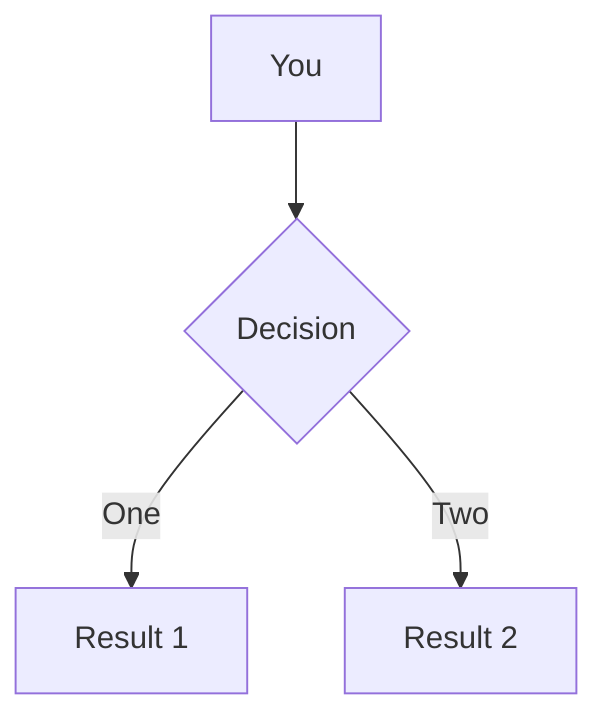

# 考研经验分享

Made with Slidev

  

  Hyoban
  

  
Wuhu, China 2022

---
layout: intro
---

# 周云亮

北方工业大学 21计研 
考研初试 375 
政治 72, 英语一 63, 数学一 98, 数据结构(925) 142 

  <ri-github-line class="opacity-50"/>
  
<a href="https://github.com/hyoban" target="_blank">hyoban</a>

  <ri-user-3-line class="opacity-50"/>
  
<a href="https://hyoban.cc" target="_blank">hyoban.cc</a>

  <ri-wechat-line class="opacity-50"/>
  
hyoban

---
layout: center
class: text-center
---

# 我的考研经历

跌宕起伏

---
clicks: 6
---

# 整体过程？

###### 阶段

###### 体会

<v-clicks at="1">

- 疫情在家自学
- 学校学习
- 初试
- 准备复试
- 复试
- 调剂

</v-clicks>

<v-clicks at="1">

- 学习效率较低
- 最充实的一段时间
- 爆炸的数学
- 浮躁
- 难以回忆
- 西南大学还是NCUT

</v-clicks>

---
layout: center
class: text-center
---

# 你应该考研吗

其实你有很多选择

---

# 选择流程

<v-click>

</v-click>

<v-click>

<h3>工作</h3>

建议：建议尝试投递简历，看看能拿到的工作情况。

优点：三年的钱💰和经验，大厂offer也很无敌

缺点：学历差别，可能因为学历后悔

 

<h3>考研</h3>

院校的选择比你的努力要重要

优点：学历永远不亏，考上重点加分很大，国企公务员等有加成？学到的东西有限（算法除外）

缺点：考不上的风险大（尤其计算机），缺少工作经验，经济需要一定支持，年龄问题

</v-click>

---
clicks: 7
---

# Q & A

###### 问题

###### 个人回答

<v-clicks at="1">

- 学校选择？
- 信息收集？
- 需要报考研机构么？
- 和他人交流？
- 考研老师的选择？
- 复习时间？
- 复习技巧？

</v-clicks>

<v-clicks at="1">

- 请给你的分数留余量，调剂基本没书读
- 招生名额，历年复试线，复试比例，复试公平度，导师信息等
- 完全没必要，不过好的学习环境是很有必要的
- 少加非必要的群，有研友应该加成不少
- 网上讨论的较多的都还行(李永乐和肖秀荣)
- 请尽量尽早全身心准备，直到你预录取。注意健康生活。
- 合理安排，人的精力有限。务必区别开视频课和自己学习。

</v-clicks>

---

# 快速回顾

- 想清楚考研的目的
- 了解研究生的现状
- 搜集院校信息，确定报考院校
- 安排好每天时间和学习计划
- 处理好考研过程的关键时间点
- 保证考试发挥
- 复试前积极准备
- 领取研究生录取通知书

---
layout: center
class: 'text-center pb-5 :'
---

# 谢谢！

幻灯片可以在我的网站 [hyoban.cc](https://hyoban.cc) 上下载
